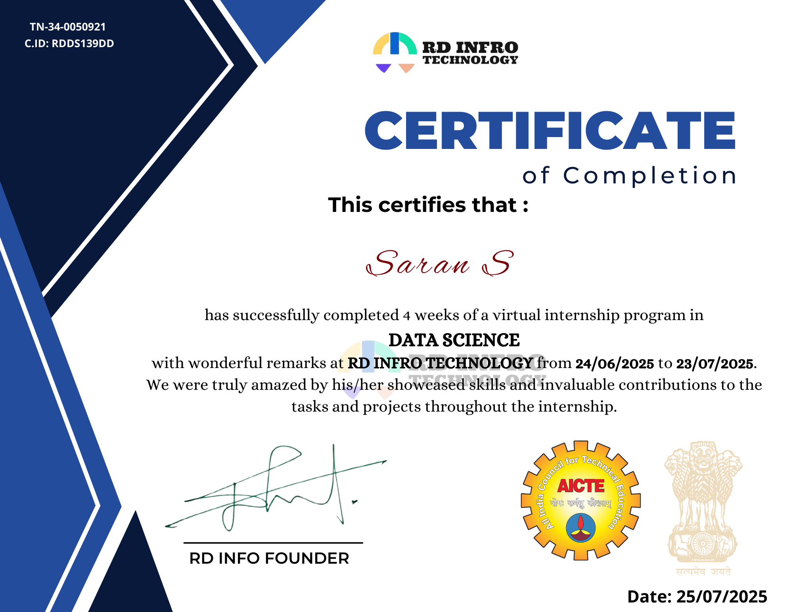

# RD INFRO TECHNOLOGY – Data Science Internship Projects (June–July 2025)

This repository showcases the hands-on projects I completed during my 4-week **virtual Data Science Internship** at [RD INFRO TECHNOLOGY](https://rdinfrotechnology.netlify.app), from **24th June 2025 to 23rd July 2025**.

The internship involved building and deploying machine learning models on real-world datasets using core data science techniques. Each project was developed independently, documented in Jupyter Notebooks, and summarized in a project-specific PDF file.

---

## 🧰 Tools & Technologies

- **Languages**: Python 3
- **Libraries**: Pandas, NumPy, Matplotlib, Seaborn, Scikit-learn
- **Platforms**: VS Code, Google Colab
- **Version Control**: Git, GitHub
- **ML Concepts**: Classification, Regression, Data Preprocessing, EDA, Model Evaluation

---

## 📁 Projects Included

### 1. 🚢 Titanic Survival Prediction
A logistic regression model was built to predict whether a passenger survived the Titanic disaster based on features like age, gender, and passenger class.

📂 Folder: `Titanic_Survival_Prediction/`  
📄 Included: Dataset, Notebook, and PDF Summary

---

### 2. 💳 Credit Card Fraud Detection
This project uses a classification algorithm to detect fraudulent credit card transactions with a focus on handling imbalanced data.

📂 Folder: `Credit_Card_Fraud_Detection/`  
📄 Included: Dataset, Notebook, and PDF Summary

---

### 3. 📉 Sales Prediction Using Python
A linear regression model was created to predict future product sales using advertising spend and other input features.

📂 Folder: `Sales_Prediction_Using_Python/`  
📄 Included: Dataset, Notebook, and PDF Summary

---

## 🏆 Internship Certificate

I was awarded the official certificate of completion upon successfully submitting all tasks:

---

## 🔗 Connect with Me

- 👨‍🎓 **Name**: Saran S  
- 🎓 **Course**: B.Tech CSBS, Rajalakshmi Institute of Technology  
- 💼 **GitHub**: [github.com/saran2007s](https://github.com/saran2007s)  
- 🔗 **LinkedIn**: [linkedin.com/in/saranselvaraj2401](https://www.linkedin.com/in/saranselvaraj2401)

---

## Acknowledgement

Thanks to **RD INFRO TECHNOLOGY** for providing a platform to work on real-world datasets and apply machine learning principles in practice. This internship has strengthened my confidence in building and explaining machine learning projects from scratch.

